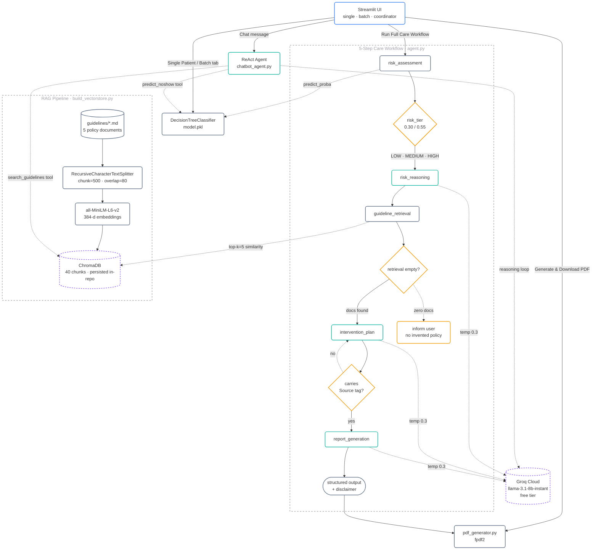

# Clinical Appointment No-Show Prediction & Agentic Care Coordination

**End-Semester Capstone — GenAI & Agentic AI**

[](https://genaicapstone4-anot5dcxcx9vhuxzsifnzb.streamlit.app/)
[](https://langchain-ai.github.io/langgraph/)
[](https://groq.com)

> **Live application:** https://genaicapstone4-anot5dcxcx9vhuxzsifnzb.streamlit.app/

A two-stage healthcare operations system. The **mid-sem** milestone built a classical
machine-learning model that predicts appointment no-shows from scheduling data.
The **end-sem** milestone extends that model into an **agentic care-coordination
assistant** that reasons over the risk prediction, retrieves the hospital's own
operational guidelines using RAG, and produces a structured, citation-grounded
intervention plan.

---

## What the application does

| Tab | What it does | Underlying technology |
|---|---|---|
| **Single Patient Analysis** | Enter a patient's demographic and scheduling profile → get a predicted no-show probability, risk tier, and rule-based quick action. | scikit-learn Decision Tree, custom feature engineering |
| **Batch Analysis** | Upload a KaggleV2-format CSV of scheduled appointments → get per-row risk tiers, a risk-distribution chart, suggested standby slots, and an exportable report. | The same ML model vectorised over the CSV |
| **AI Care Coordinator** | Chat with a LangGraph-powered agent that uses the ML model as a tool, retrieves matching policies from the hospital's guideline library, and produces plans with source citations. Also exposes a **Run Full Care Workflow** button that executes the structured 5-step agent pipeline with full transparency. | LangGraph (ReAct + StateGraph), Groq Llama 3.1 8B, Chroma vector store, HuggingFace MiniLM embeddings |

---

## System architecture

> **Full walk-through:** [`docs/architecture.md`](docs/architecture.md) · alternate PNG/SVG/DOT renders in [`report/`](report/)



**Legend** — blue = user surface · teal = LLM agent node · slate = deterministic processing · amber = gate / guardrail · purple dashed = external service. Every node on the diagram is clickable and jumps to the file that implements it.

Each workflow node updates an explicit `AgentState` (`TypedDict`) carrying the patient's profile, the risk score and tier, the retrieved guideline excerpts with source filenames, the LLM-generated plan, and the final report.

---

## Tech stack

- **UI:** Streamlit 1.56
- **ML:** scikit-learn (Decision Tree, StandardScaler), pandas, numpy
- **Agent framework:** LangGraph (`StateGraph` for the 5-step workflow; `create_react_agent` for the chat tab)
- **LLM:** Groq Cloud — `llama-3.1-8b-instant` (free tier)
- **RAG:** ChromaDB vector store + `sentence-transformers/all-MiniLM-L6-v2` embeddings
- **PDF:** fpdf2
- **Charts:** Plotly

---

## Project structure

```
.
├── app.py                  # Streamlit UI (3 tabs). Imports both agents.
├── agent.py                # 5-step LangGraph StateGraph (risk → reasoning → RAG → plan → report)
├── chatbot_agent.py        # ReAct agent with predict_noshow + search_guidelines tools
├── build_vectorstore.py    # One-shot script: chunks guidelines/, embeds them into chroma_db/
├── model_brain.py          # Trains DecisionTreeClassifier on KaggleV2 data, saves pickles
├── pdf_generator.py        # fpdf2-based structured care report
├── guidelines/             # Hospital-policy knowledge base (markdown)
│   ├── attendance_management.md
│   ├── ethical_guidelines.md
│   ├── overbooking_guideline.md
│   ├── patient_engagement.md
│   └── reminder_policy.md
├── chroma_db/              # Populated vector store (committed so the hosted app ships with it)
├── model.pkl               # Trained Decision Tree
├── scaler.pkl              # Fitted StandardScaler
├── feature_cols.pkl        # Feature-column order (14 cols)
├── docs/
│   └── architecture.md     # Full architecture walk-through with interactive diagram
├── report/                 # LaTeX report, PDF, diagrams (PNG/SVG/DOT), demo video script
├── requirements.txt
└── README.md
```

---

## Local setup

### 1. Clone and create a virtual environment

```bash
git clone https://github.com/Ansh1816/gen_ai_capstone_4.git
cd gen_ai_capstone_4
python3.11 -m venv venv
source venv/bin/activate           # Windows: venv\Scripts\activate
pip install --upgrade pip
pip install -r requirements.txt
```

### 2. Configure the Groq API key

Create a file named `.env` in the project root:

```env
GROQ_API_KEY=gsk_xxxxxxxxxxxxxxxxxxxxxxxxxxxxxxxxxxxxxxxx
```

Get a free key at https://console.groq.com/keys. The free tier is sufficient
for demos (30 requests/minute).

### 3. (Re)build the vector store (only if you edit `guidelines/*.md`)

```bash
python build_vectorstore.py
```

Output: `chroma_db/` is refreshed with 40 chunks across the 5 guideline files.
This repository ships with a pre-built `chroma_db/` so the hosted app works
out of the box — you only need to re-run this if you change the guidelines.

### 4. (Optional) Retrain the ML model

Training requires the KaggleV2 dataset at
`KaggleV2-May-2016.csv` in the project root (not committed due to size). Then:

```bash
python model_brain.py
```

The repository ships with pre-trained pickles so you can skip this step.

### 5. Run the app

```bash
streamlit run app.py
```

Open http://localhost:8501

---

## Deployment (Streamlit Community Cloud)

The hosted app is deployed to Streamlit Community Cloud from this GitHub repo.

1. **Push to GitHub** — `main` branch is watched.
2. **Streamlit Cloud → Settings → Secrets** — add:
   ```toml
   GROQ_API_KEY = "gsk_..."
   ```
3. The app auto-redeploys on every push to `main`. Cold-starts take ~30–60 s
   if the container was hibernating.

**Note:** The `chroma_db/` directory is intentionally committed so the hosted
app has a populated knowledge base on first boot. Streamlit Cloud deploys
only what is in the Git repository.

---

## How the agent handles failure modes

- **Empty retrieval** — If `search_guidelines` returns no matching policy, the
  agent's system prompt requires it to tell the user plainly, rather than
  invent hospital policies.
- **Source attribution** — Every policy claim in the agent's output carries a
  `[Source: <filename>]` citation derived from the ChromaDB metadata.
- **Operational & ethical disclaimer** — Appended to every structured output.
  The 5-step workflow tab renders a permanent disclaimer card.
- **Rate-limit / API errors** — Surfaced as a Streamlit error banner. The
  user can retry; chat history is preserved.

---

## Evaluation metrics (mid-sem baseline)

The Decision Tree model trained in [`model_brain.py`](model_brain.py) on the
Kaggle *Medical Appointment No Shows* dataset (110 527 rows) achieves
approximately:

| Metric | Value |
|---|---|
| Test accuracy | ~0.76–0.78 |
| Precision (no-show class) | ~0.30–0.38 |
| Recall (no-show class) | ~0.25–0.33 |

(Exact numbers vary by random split; the end-sem submission focuses on the
agentic layer rather than on squeezing further accuracy out of the baseline.)

---

## Team

| Member | Role |
|---|---|
| Ansh Badkur | ML model, base Streamlit UI, agent scaffolding, deployment |
| Praanshu Ranjan | Prompt engineering, 5-step workflow integration, knowledge-base deployment fix, documentation, final report, demo video |

---

## License & Disclaimer

This project is an academic capstone. The ML predictions are probabilistic and
based on historical appointment data. All policy recommendations are grounded
in the hospital guideline files in `guidelines/`. Every output from the
system is intended for **decision support only** and must be reviewed by
qualified administrative staff before any operational action is taken. This
system does not provide medical advice.
