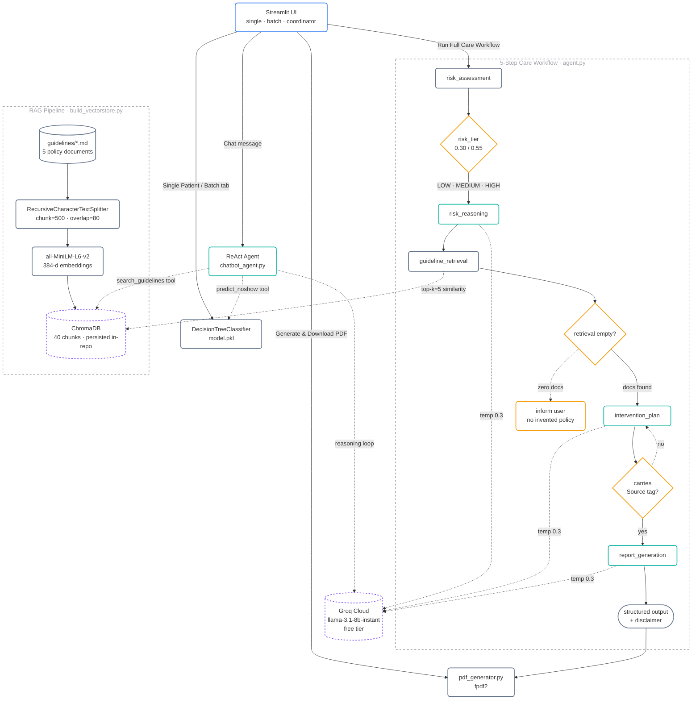

# System Architecture

End-to-end view of the **Intelligent Appointment No-Show Prediction & Agentic
Care Coordination Assistant**. Every node below is clickable — it links to
the file that implements it.

---

## Legend

| Colour | Role | Examples |
|---|---|---|
| **Blue** | User-facing surface | Streamlit UI |
| **Teal** | LLM-driven agent node | `risk_reasoning`, `intervention_plan`, `report_generation`, ReAct agent |
| **Slate** | Deterministic processing | `risk_assessment` (ML), `guideline_retrieval`, splitter, embedder, PDF generator |
| **Amber** | Decision / guardrail | risk-tier threshold, empty-retrieval check, citation enforcement |
| **Purple (dashed)** | External service | Groq Cloud, ChromaDB |

**Arrow semantics**

- **Solid** `-->` — primary control flow (happy path).
- **Dashed** `-.->` — background I/O, tool calls, guardrail fallbacks, and re-ask loops.

---

## Layer walk-through

### Streamlit UI (`app.py`)

Three tabs. The first two go straight to the ML model; the third surfaces
both the ReAct chat agent and a **Run Full Care Workflow** button that
invokes the full 5-step LangGraph pipeline.

### 5-Step Care Workflow (`agent.py`)

A LangGraph `StateGraph` with an explicit `AgentState` `TypedDict`:

1. **`risk_assessment`** — Decision Tree predicts no-show probability, thresholds
   pick a tier.
2. **`risk_reasoning`** — LLM explains the prediction in plain English anchored
   to the patient's actual values.
3. **`guideline_retrieval`** — builds a tier- and factor-aware query, pulls the
   top-5 chunks from ChromaDB.
4. **`intervention_plan`** — LLM grounds the recommendation in the retrieved
   excerpts; every claim carries a `[Source: filename]` tag.
5. **`report_generation`** — structured final report with patient summary,
   risk, reasoning, plan, sources, and ethical disclaimer.

### Conversational ReAct Agent (`chatbot_agent.py`)

Built with `langgraph.prebuilt.create_react_agent`. Two tools:

- **`predict_noshow`** — calls the Decision Tree; returns `{risk_score, risk_tier}`.
- **`search_guidelines`** — similarity search over ChromaDB; returns
  `[Source: <filename>]`-prefixed excerpts, or the literal fallback
  `"No specific guidelines found for this query."` when empty.

The system prompt hardens the behaviour: require exact probabilities, require
source tags on every policy claim, refuse to invent policy when retrieval is
empty, and always append the operational-and-ethical disclaimer.

### RAG Pipeline (`build_vectorstore.py`)

Offline, one-shot. Chunks the five markdown documents under `guidelines/`
(chunk 500, overlap 80), embeds with `sentence-transformers/all-MiniLM-L6-v2`
on CPU, and persists into `chroma_db/`. The populated store is committed
in-repo so the hosted container ships with a ready-to-use knowledge base on
first boot.

### Guardrails

Five enforcement points, four of which are drawn as amber gates above:

| Guardrail | Where | Purpose |
|---|---|---|
| Risk tier | `risk_assessment` output | Maps probability to operational tier. |
| Retrieval empty check | `search_guidelines` tool | Emits a literal fallback rather than silence. |
| Citation enforcement | ReAct system prompt | Every policy claim must carry `[Source: filename]`. |
| Hallucination refusal | ReAct system prompt | Must say "no matching policy" rather than invent. |
| Disclaimer | every structured output | Operational + ethical notice on every report. |

---

## Alternate renders

If your viewer does not support Mermaid, the same architecture is available as
a high-resolution PNG and SVG in the `report/` directory:

- [`report/fig_architecture_graphviz.png`](../report/fig_architecture_graphviz.png) — 200-DPI PNG
- [`report/fig_architecture_graphviz.svg`](../report/fig_architecture_graphviz.svg) — scalable vector
- [`report/fig_architecture.dot`](../report/fig_architecture.dot) — Graphviz source
- [`report/fig_architecture.mmd`](../report/fig_architecture.mmd) — plain Mermaid source
